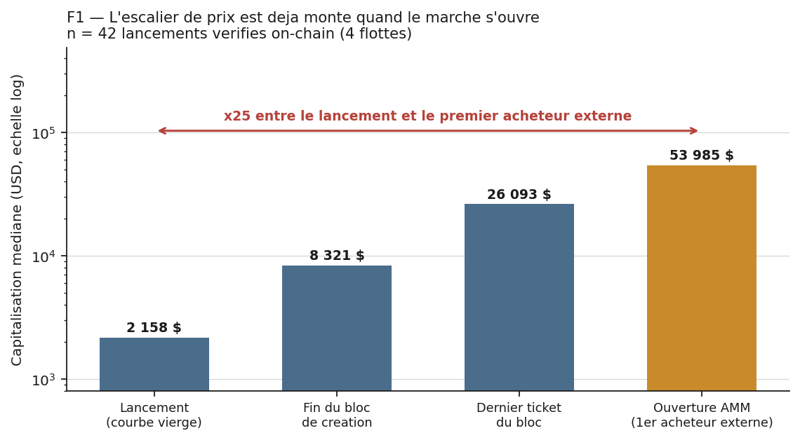
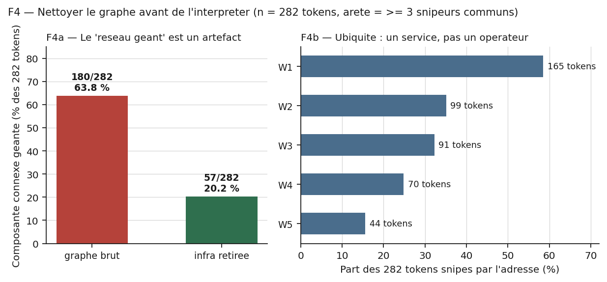
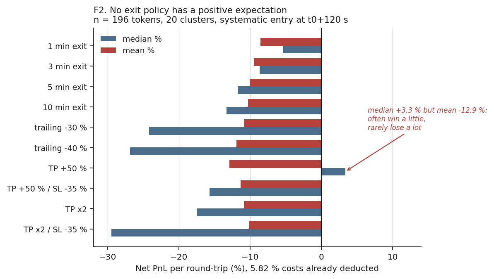
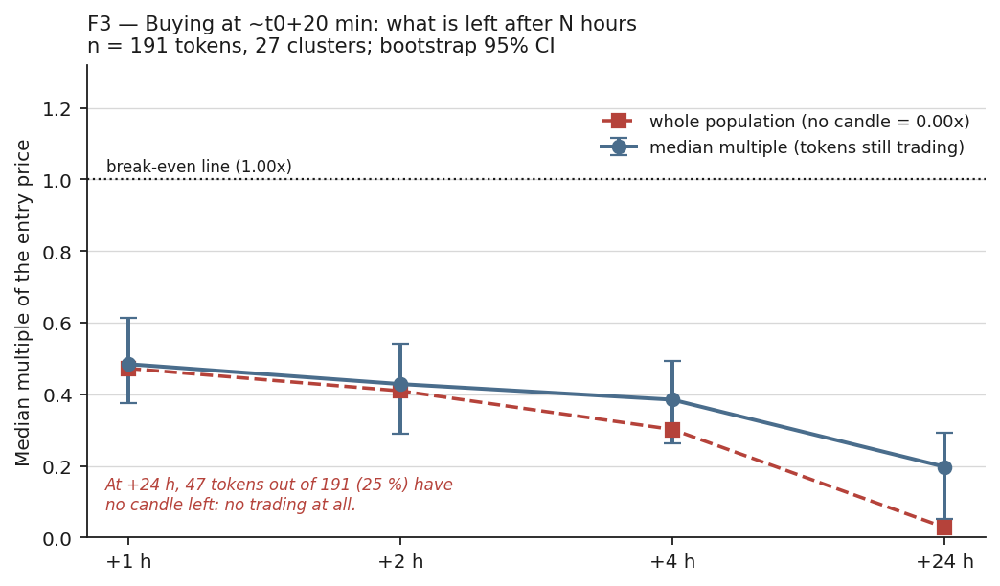

# Résultats techniques — microstructure des lancements pump.fun

> **Summary (EN).** Three measured results on a 7-day capture of Solana memecoin launches
> (645 capture files, 293 with swap flow, 282 with identified early buyers, 511 508 swaps).
> **(1) Launch mechanics.** On 42 launches verified transaction-by-transaction, the entire bonding
> curve is bought inside the *creation slot itself* — median 85.2 SOL for 79.0 % of supply, with
> **zero** curve purchase preceding it in 42/42 cases. The position is transferred out at a median
> **t+17.5 s**. Median market cap goes from ~2 158 $ at launch to ~53 985 $ when the first external
> buyer can transact: **×25 before the market opens**. On a separate frozen sample of 70 tokens that
> reached ≥ 500 k$, **58/70 = 82.9 %** [95 % CI 72.4–89.9] carry this creation-slot signature.
> **(2) Operator clusters.** A token–token graph is dominated by 9 shared-infrastructure addresses:
> removing them collapses the giant component from **180/282 to 57/282 tokens**. Once cleaned,
> 6 disjoint clusters cover 76/282 tokens, with intra-cluster wallet reuse of 0.90–1.00 against a
> **0.019 base rate**. Two clusters sharing *no wallet and no token* nonetheless share a byte-level
> execution fingerprint — a shared tool, not a shared identity.
> **(3) Cost to a buyer.** Across **15 exit policies** on 196 tokens / 20 clusters, the mean is
> negative **15/15** and no policy has a 95 % CI (cluster bootstrap) above zero. 21.3 % of tokens
> (n=1243) have already peaked at first external visibility, 50 % within 120 s.
> **What is deliberately not claimed:** operator identity does not predict how high a token goes
> (p = 1.000), the clusters' tokens perform *below* baseline, and the ≥500 k$ sample is not random.
> Every figure regenerates from `code/` + `data/` with no network access.

**Fenêtre** : 2026-06-27 → 2026-07-04 (7 jours UTC). **Périmètre** : lancements pump.fun dits
*fast-grad* (graduation rapide vers l'AMM). Toutes les adresses et signatures citées sont des
identifiants techniques publics, vérifiables sur un explorateur Solana. Aucune intention, aucune
identité et aucune personne ne leur est attribuée : ce document décrit une microstructure de marché.

---

## 0. Le corpus, et ce qu'il ne couvre pas

| grandeur | valeur | source |
|---|---|---|
| fichiers de capture | 645 | `data/v01_corpus.json` |
| captures avec flux de swaps | 293 | idem |
| captures avec acheteurs précoces identifiés | 282 | idem |
| swaps (recompte brut) | **511 508** | idem |
| adresses distinctes | 91 353 (brut) | idem |
| wallets snipeurs distincts | 1 616 (2 894 occurrences) | idem |
| lancements vérifiés transaction par transaction | **42** | `data/v05`, `v06`, `v07` |
| tokens ≥ 500 k$ ré-audités on-chain | **70** (gelé le 29/07) | `data/v09_signature_gros_tokens.json` |

⚠️ **Écart de comptage assumé.** `docs/out/m1_corpus.json` publie 476 847 swaps et 90 979 adresses,
soit ~7 % de moins que le recompte brut ci-dessus. `m1` applique un filtre supplémentaire qui n'est
pas documenté dans son en-tête. Les deux chiffres sont publiés ; **aucun résultat de ce document ne
dépend de ce total**, qui ne sert qu'à décrire la taille du corpus.

⚠️ **Couverture réelle du capteur : 6,8 %.** `floor_capture` ne voit que **282 / 749** tokens
fast-grad de sa propre fenêtre (0,377), et sur-échantillonne les gagnants (part d'ATH ≥ 200 k$ :
0,337 chez les tokens captés contre 0,255 chez les non captés). Combiné au taux d'attribution à un
cluster (0,181), le bout-en-bout réel est de **6,8 %**. Le corpus n'est donc **pas** un échantillon
représentatif du flux : c'est un échantillon biaisé vers les lancements qui ont marché, et tous les
résultats ci-dessous doivent se lire ainsi.

---

## 1. Le mode opératoire reconstitué

### 1.1 Le geste, mesuré sur 42 lancements

La bonding curve pump.fun gradue vers l'AMM aux alentours de 85 SOL. Sur les 42 lancements
reconstitués transaction par transaction, cette courbe est rachetée **en totalité, dans le slot de
création du token**, avant que quiconque d'autre puisse transiger.

**Table A — Le geste commun (n = 42 lancements, 4 clusters)**

| mesure | médiane | Q1–Q3 | min–max | source |
|---|---|---|---|---|
| SOL engagé dans le bloc de création | **85,21** | 83,12 – 85,72 | 79,49 – 87,46 | `v05` |
| part de la supply totale raflée | **78,95 %** | 78,31 – 79,09 % | 76,78 – 79,25 % | `v05` |
| part de la courbe captée | 79,09 % | — | 77,60 – 79,29 % | `v06` |
| part du SOL de courbe captée | **98,72 %** | — | — | `v06` |
| achats de courbe **avant** le bloc | **0** | — | max = 0 SOL (**42/42**) | `v06` |
| écart temporel intra-noyau | **0 s / 0 slot** | — | 42/42 | `v02` |
| CV des tickets à l'intérieur du bloc | 0,0265 | — | — | `v05` |
| dev-buy du créateur | 0,068 SOL | — | — | `v06` |
| taille du bloc | 4 wallets (33 cas) / 5 wallets (9 cas) | — | — | `v05` |

Deux lignes portent l'essentiel :

- **`achats de courbe avant le bloc = 0, sur 42/42`.** Ce n'est pas « l'opérateur est rapide » :
  c'est qu'il n'y a **aucune fenêtre** entre la création du token et le rachat de la courbe. Le
  premier acheteur externe possible arrive après.
- **`écart temporel intra-noyau = 0 s et 0 slot, sur 42/42`.** Les 4 (ou 5) achats sont dans le même
  slot Solana. Aucun observateur externe, si rapide soit-il, ne peut s'intercaler.

### 1.2 L'escalier de prix



**Table B — Capitalisation médiane à chaque étape (n = 42)**

| étape | MC médiane | ×  vs lancement |
|---|---|---|
| lancement (courbe vierge, constante de 27,96 SOL) | **2 158 $** | ×1 |
| exécution du bloc de création | 8 321 $ | ×3,9 |
| après le dernier ticket du bloc | 26 093 $ | ×12,1 |
| **ouverture AMM = premier acheteur externe possible** | **53 985 $** | **×25,0** |

Ratio ouverture AMM / exécution du bloc : **médiane ×6,54** (n = 42, plage 0,22 – 14,57 ;
**40/42 ≥ ×3**).

**Convergence indépendante.** Ce ×25 est retrouvé sur une **autre population et une autre méthode** :
`docs/out/m2_entry_price.json` mesure, sur les **293** captures, une capitalisation médiane de
**706 SOL au premier instant observable de l'extérieur** contre la constante de lancement de
27,96 SOL, soit **×25,2** [IC95 672 – 724 SOL]. La part du log-run lancement → pic déjà consommée à
cet instant est de **0,90 en médiane**. Deux mesures sans code commun, à 0,2 point l'une de l'autre.

### 1.3 Cinq lancements vérifiables

Chaque ligne est un mint public. Le slot, le nombre de wallets du bloc, le SOL engagé et le délai de
transfert sont vérifiables sur un explorateur Solana à partir du mint seul.

**Table C — Cinq lancements, bout en bout**

| mint | cluster (lead) | slot de création | wallets du bloc | SOL du bloc | supply raflée | achats avant | MC bloc → ouverture AMM | transfert du sac (médiane) | collecteurs |
|---|---|---|---|---|---|---|---|---|---|
| `87QChghgFr2XBNumi2Tg1MJCWHLqoTTT5KThtnDspump` | C1 `22vL22Pc…` | 429 307 208 | 4 | 84,94 | 78,05 % | **0** | 8 401 $ → 122 404 $ | t+23,5 s (19–35) | 3 |
| `DuiJLBQbnW7q5DibZNUckqtQbPMpMrXyc81iSNmzpump` | C1 `22vL22Pc…` | 429 722 432 | 4 | 85,23 | 79,10 % | **0** | 8 317 $ → 60 423 $ | t+14,0 s (9–18) | 4 |
| `9hrV5rTGN7s2noUZwo84kpFZKmhsnRuMS6AVMs1upump` | C2 `339QJtzB…` | 429 338 545 | 4 | 82,08 | 77,99 % | **0** | 8 125 $ → 52 951 $ | t+16,5 s (6–27) | 4 |
| `hCVRw8Qq9e8ZTeGYzWBoY8G5GvhDdkoMDmy4MWypump` | C3 `2GMhqu3c…` | 429 414 857 | 4 | 84,81 | 78,84 % | **0** | 8 304 $ → 51 938 $ | t+22,0 s (14–35) | 4 |
| `ALbvXciC8k4P3G57b4hMRPypvvsc2Rr9K4WucSwLpump` | C4 `2LLHCtDp…` | 430 477 517 | 4 | 79,49 | 77,45 % | **0** | 7 923 $ → 59 736 $ | t+13,0 s (13–13) | 4 |

Les 5 tokens ont **5 créateurs différents** (`78wF7WAi…`, `Gcdpw19Y…`, `9vivFUKu…`, `E7B2ojFo…`,
`EaopWCEj…`). Aucun n'est réutilisé. Voir §2.3 : ce point disqualifie l'interprétation « ces clusters
lancent les tokens ».

### 1.4 Le template est déterministe — et ça se prouve

En vérifiant la table C, cinq lancements du cluster C2 se sont révélés porter des valeurs
**identiques au dix-millième** : mêmes 4 tickets `[21,1299 / 20,8140 / 20,4678 / 19,6699]`, même
`tokens_bloc = 779 852 771,1`, même part de supply `0,77985`, sur cinq tokens différents.

Une répétition parfaite est d'abord un signal de **bug de données** (enregistrement dupliqué). Le
contrôle a été fait avant toute publication :

| contrôle | résultat | conclusion |
|---|---|---|
| créateurs des 5 tokens | **5 créateurs distincts** | pas un doublon |
| ordre d'exécution des 4 wallets | **différent** sur 3 des 5 | pas un doublon |
| slots | 5 slots distincts, étalés sur ~23 000 slots | pas un doublon |
| dev-buy en **tokens** | `3 564 784,69` — identique | *explique* la répétition |
| valeurs distinctes de `tokens_bloc` sur les 42 | **35 / 42** | la répétition est locale, pas globale |

**Diagnostic** : le dev-buy achète une **quantité fixe de tokens**, donc l'état de la courbe à
l'entrée du bloc est identique d'un lancement à l'autre ; une échelle d'achat exprimée elle aussi en
quantité de tokens coûte alors un montant de SOL identique au dix-millième. Ce n'est pas un artefact
de données : c'est un **template d'exécution codé en dur**, et la constance des chiffres en est la
signature la plus lisible. Le CV inter-lancements du cluster C2 est de **0,0075** (`v02`).

### 1.5 La sortie

**Table D — Sortie de position (n = 42 lancements, 177 wallets de bloc)**

| mesure | valeur |
|---|---|
| wallets transférant leur sac | **162 / 177** |
| wallets vendant directement | 46 / 177 |
| part de la supply transférée (médiane) | **99,99 %** |
| délai du premier transfert | **médiane 17,5 s**, Q1–Q3 13,0 – 26,2 s, plage 0 – 80 s |
| collecteurs distincts (2ᵉ étage) | 41 |

Le sac n'est presque jamais vendu par le wallet qui l'a acheté : il est transféré en SPL, à
**t+17,5 s en médiane**, vers un second étage d'adresses qui liquident ensuite en série. Le rapport
forensique mesure ces liquidations à **119 à 194 tranches** d'environ 4 SOL espacées de ~1,5 s selon
le cluster (n = 42 ; comptage par cluster, pas par lancement — à traiter comme un ordre de grandeur).

**Asymétrie d'âge des wallets** (n = 476 wallets datés exactement) :

| population | n | âge médian au 1ᵉʳ snipe |
|---|---|---|
| créateur du token | 151 | **0,03 j (~45 min)** — 75,5 % ont moins d'un jour |
| snipeur jetable (1–2 tokens) | 267 | 0,22 j |
| membre de cluster | 58 | **32,5 j** (q75 = 118 j) ; les 4 clusters « quad » : 118 / 228 / 419 j |

Le wallet **créateur est jetable et frais** ; les wallets **d'achat sont pré-provisionnés en lot et
vieillis** des mois avant emploi, puis réutilisés sur 6 à 14 lancements. Les 4 wallets du cluster C3
ont été créés **en 50 secondes** (12/11/2025) et employés **228 jours** plus tard.

### 1.6 La signature sur les gros tokens — et ses trois limites

Question posée séparément : quand un token atteint une capitalisation élevée, porte-t-il cette
signature d'ouverture ? Test on-chain **indépendant du détecteur**, sur un échantillon **gelé** de
70 tokens d'ATH ≥ 500 k$ (`code/f_signature_gros_tokens.py`).

| mesure | valeur |
|---|---|
| ATH médian de l'échantillon | 1 205 423 $ |
| courbe rachetée (≥ 60 SOL) **dans le slot de création** | **58 / 70 = 82,9 %** — IC95 Wilson **[72,4 ; 89,9]** |
| accord « rachat en 30 s » vs « rachat dans le slot de création » | **70 / 70** |
| SOL engagé dans ce slot | médiane **85,01** (81,79 – 85,01) |
| acheteurs dans ce slot | médiane 4 (1 – 13) |

L'accord **70/70** est le fait le plus net du dossier : il n'existe pas de cas intermédiaire où la
courbe serait rachetée en quelques secondes *sans* l'être dans le slot de création. Il n'y a pas de
fenêtre — il y a une porte fermée.

⚠️ **Trois limites, à lire avec le chiffre :**

1. **L'échantillon n'est pas aléatoire.** Ce sont les 70 premiers tokens ≥ 500 k$ dans l'ordre du
   fichier source. L'IC95 quantifie l'erreur d'échantillonnage, pas le biais de sélection.
2. **La signature ne fait pas monter les tokens.** Dans ces mêmes 70 : ATH médian **avec** signature
   (n=58) = **1,13 M$** ; ATH médian **sans** signature (n=12) = **2,33 M$**. Les tokens *sans* la
   signature montent **plus haut**. Elle décrit un démarrage, elle ne prédit pas une trajectoire.
3. **C'est P(signature | gros), pas P(gros | signature).** Cette mesure est conditionnée sur le
   succès. Elle ne dit rien de la part de lancements snipés dans le flux général, ni de la
   probabilité qu'un lancement snipé réussisse. Confondre les deux serait exactement le biais de
   sélection sur l'outcome documenté dans `PITFALLS.md`.

### 1.7 Une réconciliation trouvée en écrivant cette section

Les deux scripts `v05_creation_block.py` et `v06_curve_ladder.py` calculent tous deux la
capitalisation à l'ouverture AMM. Leurs médianes publiées divergent : **46 147 $ contre 53 985 $**,
et le désaccord porte sur **42 lancements sur 42**, avec des écarts unitaires allant jusqu'à un
facteur 100 (un lancement à 78 $ contre 11 435 $).

Diagnostic : `v05` retenait le **premier swap venu** et se faisait piloter par des échanges poussière
de ~0,002 SOL, dont le prix implicite est aberrant. `v06` prend la **médiane des swaps PUMP_AMM
≥ 0,1 SOL des 60 premières secondes** — sa docstring déclare explicitement corriger `v05`.

**`v06` fait autorité ; les chiffres de ce document en viennent.** L'épisode est conservé ici parce
qu'il illustre le mécanisme central du dossier : deux implémentations de la même grandeur, un écart,
et une convention d'estimation robuste qui tranche. Sans le croisement, la valeur fausse aurait été
publiée — elle l'était déjà dans `v05`.

---

## 2. Les clusters d'opérateurs par analyse de graphe

### 2.1 Le piège d'abord : nettoyer avant d'interpréter



Construire un graphe token–token (arête si deux tokens partagent ≥ 3 acheteurs précoces) sur les
282 captures donne une **composante géante de 180 tokens sur 282 (63,8 %)**. Lue naïvement, elle
décrit « un réseau unique couvrant les deux tiers du marché ». C'est faux.

Un petit nombre d'adresses achète une fraction énorme de **tous** les lancements. Ce ne sont pas des
opérateurs : ce sont des **services** utilisés par tout le monde, qui relient artificiellement
n'importe quelle paire de tokens.

**Table E — Ubiquité des 5 premières adresses d'infrastructure (n = 282 tokens)**

| id | tokens snipés | part du corpus |
|---|---|---|
| **W1** | 165 | **58,5 %** |
| W2 | 99 | 35,1 % |
| W3 | 91 | 32,3 % |
| W4 | 70 | 24,8 % |
| W5 | 44 | 15,6 % |

**En retirant 9 adresses de ce type, la composante géante tombe de 180 à 57 tokens (63,8 % →
20,2 %).** Le « réseau géant » était un artefact de pontage. C'est le piège le plus facile à commettre
sur ces données, et le dépôt publie le test qui le démontre (`code/m4_infra_ubiquity.py`), pas
seulement la conclusion.

Deux corrections de classification, gardées parce qu'elles vont dans les deux sens :

- **W1 avait été étiqueté « bot de volume mono-mint ».** Faux : sur ses 500 dernières transactions,
  45 mints distincts, mint dominant à 4,0 %. Le test « ≥ 90 % des tx sur un seul mint » ne passe sur
  **0 wallet / 57**. W1 est exclu pour **ubiquité**, pas pour mono-mint — la bonne raison compte.
- **`GeBJSHK4…` avait été classé infrastructure** par le clustering. Faux : c'est un créateur de
  51 tokens qui achète les siens. Le classer en infra l'aurait fait **manquer**. Un filtre
  d'infrastructure trop large coûte des vrais positifs.

### 2.2 Ce que le graphe donne une fois nettoyé

**Table F — Les 6 clusters (n = 282 tokens capturés)**

| cluster | adresses du noyau | tokens | wallets / lancement | réutilisation intra-cluster | CV inter-lancements | SOL médian |
|---|---|---|---|---|---|---|
| C1 `22vL22Pc…` | 7 (**substitue un titulaire en cours de série**) | 14 | 4 | 0,904 | 0,146 | 84,97 |
| C2 `339QJtzB…` | 4 | 12 | 4 | 1,000 | **0,0075** | 80,90 |
| C3 `2GMhqu3c…` | 4 (**0 rotation sur 10 lancements**) | 10 | 4 | 1,000 | 0,0118 | 85,10 |
| C4 `2LLHCtDp…` | 4 | 6 | 4 | 1,000 | 0,0345 | 79,62 |
| C5 `yHCxHBEa…` | 1 + 12 sous-wallets | 24 | 1 | 1,000 | 0,316 | 84,9 |
| C6 `GeBJSHK4…` | 1 | 10 | 1 | 1,000 | **0,000** | **84,0 exactement, 10/10** |
| **base de comparaison** | — | — | — | **0,0191** | — | — |

**Ce qui rend ces clusters solides :**

- **Réutilisation 0,904 – 1,000 contre une base de 0,0191**, soit un facteur ~47 à 52.
- **Co-occurrence** : sur les paires du noyau C1, lift **×20 à ×22**, p de 2×10⁻¹⁹ à 6×10⁻²⁴.
- **Disjonction totale** : les 6 clusters ne partagent **aucun token** (0 paire) et **aucune adresse**
  (0 paire). Ils ne sont pas des morceaux arbitraires d'un même blob.
- **Persistance hors fenêtre** : les 4 clusters « quad » sont retrouvés en activité **25 jours après**
  la fenêtre de capture, mêmes wallets, même ticket, alors que toute leur couche de financement avait
  été renouvelée entre-temps.

Couverture : **76 / 282 tokens = 27,0 %**. Le reste du corpus est atomisé — **1 062 créateurs sur
1 183 (90 %) n'ont lancé qu'un seul token** (n = 1 701 tokens mappés). Le marché observé est
majoritairement individuel, pas industriel.

### 2.3 Ce que ces clusters ne sont pas

**42 tokens, 42 créateurs différents, zéro répétition.** Les clusters C1–C4 n'ont aucun lien avec les
wallets qui créent les tokens qu'ils achètent. L'hypothèse initiale — « ce sont des lanceurs qui
snipent leurs propres tokens » — est **réfutée** : ce sont des acteurs côté **demande**, qui achètent
la courbe de tokens créés par d'autres.

**Et « bundle » est un abus de langage ici.** Le signataire dominant vaut exactement **1/n** sur tous
les tokens (n = 42 pour les quads, n = 187 hors cluster) : **chaque wallet signe sa propre
transaction**, 0/42 duplication. Il n'y a **pas** de bundle atomique à fee-payer partagé. Le seul
mécanisme d'atomicité observé est un bundle Jito à tip unique, sur 2 clusters. Le terme est conservé
dans le code pour raisons historiques ; il ne décrit pas un fait technique.

> **Écarté faute de preuve.** L'hypothèse d'une transition historique « achats séquentiels et donc
> observables → bundle atomique et donc invisible » est **non testable sur ces données** : la marche
> arrière dans l'historique n'a aucune profondeur (le plus ancien enregistrement atteint est le jour
> même). Aucune datation n'est proposée. Le mot « atomique » est de surcroît réfuté ci-dessus.

### 2.4 Deux familles logicielles, pas six opérateurs

Trois axes techniques indépendants donnent **la même partition** des 4 clusters quad :

| | **{C1, C3}** | **{C2, C4}** |
|---|---|---|
| Address Lookup Tables | 100 % | partielle |
| frais par transaction | 11 500 lamports | 6 500 lamports |
| tip Jito | aucun | **destinataire codé en dur** (un client standard tire au sort parmi 8) |
| ordre des tickets | strictement décroissants **16/16** | non monotones |

Deux clusters qui ne partagent **ni wallet ni token** exécutent le même binaire, au lamport près.
L'inférence défendable est **« outil partagé ou vendu »**, pas **« même acteur »** — et la distinction
est le résultat, pas une prudence de forme.

### 2.5 Les trois attaques — ce que le graphe ne permet PAS de conclure

Un graphe de co-occurrence produit des clusters même sur du bruit. Trois attaques ont été montées
contre les conclusions ci-dessus ; **elles en détruisent la partie prédictive**.

**Attaque A — le null du graphe était aveugle au temps.**
Le modèle nul initial (Chung-Lu, degrés préservés) donnait « 19 clusters significatifs ». Il ignore
que deux tokens du même jour partagent des acheteurs par simple co-présence temporelle. Avec un null
qui **préserve le jour de chaque arête** : **1 502 paires de faux positifs sur 6 024 (25 %)**, et la
composante géante nulle atteint 564 wallets contre 668 observés. Seuls les **quads parfaits**
résistent (1 observé, **0 dans 30 rejeux**). Les 6 clusters de la table F sont les survivants de ce
test ; les 13 autres « flottes candidates » ne le sont pas.

**Attaque B — l'identité de l'opérateur ne prédit rien.**

| test | résultat |
|---|---|
| ANOVA-permutation, 4 opérateurs, n = 46 tokens | l'identité explique `ATH ≥ 200 k$` à **p = 1,000** |
| test hors échantillon de la revendication exacte | **×1,162** sur les tokens sélectionnés, **×1,167** sur ceux qu'on aurait écartés → l'identité vaut **−0,5 % relatif** |
| meilleur groupe | le groupe **INCONNU** (noyaux non attribuables) : `ATH ≥ 300 k$` = **0,286** contre 0,083 – 0,100 pour les clusters nommés |
| tokens à signature de noyau (n = 54) | `ATH ≥ 300 k$` = **0,130** [0,064 ; 0,244] contre **0,213** pour la base (n = 268) |

**Les tokens des clusters identifiés font moins bien que le marché.** Leur profit vient
intégralement de l'écart entrée → ouverture AMM (§1.2), **pas** d'une capacité à faire monter le prix.

**Attaque C — la sélection du « meilleur opérateur » est de la survie.**
Une règle « k ≥ 8 tokens » appliquée en walk-forward donne un taux apparent de 0,512 (n = 125). Sans
les **2 adresses** qui fournissent 55–64 % des tokens sélectionnés, il retombe à **0,326** contre une
base de 0,309 : la règle avait **mémorisé 2 adresses sur 822 créateurs**. Une règle live appliquée à
mi-parcours n'aurait pas choisi le meilleur opérateur — il était **5ᵉ sur 22**. En équipondérant par
créateur (la vraie unité), 6 créateurs sur 13 ont un résidu positif : pile ou face.

**Conclusion de la section.** Le graphe **identifie** des structures réelles, reproductibles et
persistantes. Il **ne fournit aucun pouvoir prédictif** sur la trajectoire de prix d'un token. Ces
deux phrases sont le résultat ; publier la première sans la seconde serait le trahir.

---

## 3. La quantification du coût pour l'acheteur

### 3.1 Le mouvement précède le signal

**Table G — Où en est le prix quand un observateur externe voit le token (n = 1 243, 123 clusters, 20 jours)**

| bande de MC à la détection | n | ATH déjà passé | ATH < +60 s | ATH < +120 s | délai médian jusqu'à l'ATH |
|---|---|---|---|---|---|
| 5k – 20k | 16 | 43,8 % | 62,5 % | 62,5 % | 0,1 min |
| 20k – 30k | 108 | 23,1 % | 55,6 % | 60,2 % | 0,5 min |
| 30k – 40k | 137 | 27,7 % | 60,6 % | 65,7 % | 0,3 min |
| 40k – 50k | 296 | 18,9 % | 44,6 % | 54,4 % | 1,7 min |
| 50k – 65k | 277 | 26,4 % | 46,6 % | 51,6 % | 1,6 min |
| 65k – 85k | 121 | 26,4 % | 52,1 % | 58,7 % | 0,9 min |
| 85k – 120k | 123 | 14,6 % | 31,7 % | 35,8 % | 6,7 min |
| 120k – 300k | 165 | 9,7 % | 17,6 % | 23,0 % | 36,1 min |
| **toute la population** | **1 243** | **21,3 %** | **43,8 %** [41,1 ; 46,6] | **50,0 %** | **2,0 min** |

**21,3 % des tokens ont déjà atteint leur maximum au moment de leur première visibilité extérieure.
50 % l'atteignent dans les 120 secondes.** Ce résultat ne dépend d'aucun modèle : il transforme une
question de marché en question de **latence**.

> **Chiffre corrigé.** Une note de travail antérieure avançait « 67 % des tokens avaient déjà atteint
> leur maximum ». Ce 67 % ne se retrouve que sur la bande < 20 k$ de la population A, où **n = 3**.
> La valeur sur population propre est **21,3 %** (n = 1 243). C'est celle qui est publiée.

### 3.2 Quinze politiques de sortie, toutes négatives



Protocole : entrée **systématique** à t0+120 s, **sans aucun filtre d'entrée**, sur les 196 tokens
exploitables (20 clusters, 6 jours). Coûts de **5,8241 % aller-retour** (1 % de frais + 2 % de
slippage adverse par jambe) déjà retranchés. Décisions live-safe : la décision prise sur un bucket
de 30 s s'exécute au bucket suivant, jamais au prix qui l'a déclenchée.

| résultat | valeur |
|---|---|
| politiques à **moyenne négative** | **15 / 15** |
| politiques à médiane négative | 12 / 15 |
| politiques positives **à la fois** en médiane et en moyenne | **0 / 15** |
| politiques dont l'IC95 de moyenne (bootstrap **au niveau cluster**) est au-dessus de zéro | **0 / 15** |
| moyenne des moyennes | **−11,3 %** par aller-retour |

**Le piège que ce tableau rend visible.** Les seules médianes positives sont des take-profits serrés,
et leur espérance est **la pire du tableau** : `tp30` affiche une médiane de **+22,4 %** pour une
moyenne de **−16,4 %**. Gagner souvent un peu, perdre rarement beaucoup. Lire la médiane seule sur
une distribution à queue épaisse inverse la conclusion.

**Aucune correction de multiplicité n'est nécessaire** ici, et c'est une propriété du résultat :
il est négatif partout, et balayer davantage de politiques ne peut que rendre un résultat
uniformément négatif *plus* difficile à obtenir par hasard.

### 3.3 Les entrées post-snipe, et la colonne qui détruit son propre résultat

Sept règles d'entrée testées après le rachat de courbe, sortie commune à la fin de la capture
(≤ 20 min).

| règle d'entrée | n | multiple médian | IC95 | % multiple > 1 | moyenne nette | **moyenne sans le meilleur token** |
|---|---|---|---|---|---|---|
| graduation (+120 s) | 196 | **0,81** | [0,61 ; 0,93] | 40,3 % | −10,2 % | −13,8 % |
| retrace −20 % | 181 | 0,70 | [0,56 ; 0,91] | 38,1 % | −15,6 % | −19,5 % |
| retrace −30 % | 160 | 0,64 | [0,53 ; 0,84] | 35,0 % | −14,0 % | −24,2 % |
| retrace −40 % | 135 | 0,63 | [0,51 ; 0,84] | 33,3 % | **+16,6 %** | **−15,2 %** |
| retrace −50 % | 118 | 0,67 | [0,46 ; 0,80] | 28,0 % | **+22,3 %** | **−14,1 %** |
| retrace −60 % | 86 | 0,46 | [0,09 ; 0,73] | 23,3 % | **+23,9 %** | **−26,3 %** |
| retrace −70 % | 61 | 0,16 | [0,00 ; 0,51] | 16,4 % | **+13,1 %** | **−58,0 %** |

**Aucune règle n'atteint un multiple médian de 1.** La meilleure est `graduation (+120 s)` à
**0,81×** [0,61 ; 0,93].

La moyenne devient positive sur les retracements profonds (−40 % à −70 %). **Ce n'est pas un edge**,
et le tableau publie les deux contrôles qui le montrent : (a) l'IC95 de moyenne bootstrappé au niveau
**cluster** traverse zéro sur chacune de ces lignes ; (b) retirer **le seul meilleur token** fait
repasser **toutes** ces moyennes en négatif, jusqu'à −58 %. Une queue droite épaisse portée par une
poignée de tokens n'est pas une espérance positive.

### 3.4 Ce qu'il reste après quelques heures



Achat au prix robuste des 120 dernières secondes de la capture (~t0+20 min), revente au `close` de
la bougie horaire d'échéance. n = 128 tokens, 18 clusters.

| horizon | n avec bougie | sans bougie | multiple médian | IC95 | % > 1 | population entière |
|---|---|---|---|---|---|---|
| +1 h | 127 | 1 (1 %) | **0,45** | [0,30 ; 0,60] | 16,5 % | 0,45 |
| +2 h | 125 | 3 (2 %) | 0,42 | [0,28 ; 0,59] | 18,4 % | 0,41 |
| +4 h | 121 | 7 (5 %) | 0,38 | [0,26 ; 0,51] | 15,7 % | 0,31 |
| +24 h | 97 | **31 (24 %)** | **0,22** | [0,06 ; 0,35] | 12,4 % | **0,03** |

La colonne « population entière » compte **0,00×** les tokens qui n'ont plus **aucune bougie** à
l'échéance, c'est-à-dire plus aucun échange : c'est la convention honnête pour un actif qu'on ne peut
plus vendre. À +24 h, **24 % des tokens sont dans ce cas**, et le multiple médian de la population
entière tombe à **0,03×**.

**Contrôle d'unités publié avec le résultat.** Le rapport (prix externe en USD / prix de swap en SOL)
divisé par (SOL en USD) vaut **0,833 en médiane sur n = 193**. Proche de 1 ⇒ la conversion est
correcte. Sans cette conversion, tous les multiples de cette table seraient **multipliés par ~76** —
une erreur d'unité aurait transformé une perte de 78 % en un gain de ×34.

> **Chiffres corrigés.** Des notes antérieures avançaient « 0,35× à +1 h et 0,08× à +24 h », et
> « 50 % des tokens sans volume ». Les valeurs régénérées sur le corpus actuel sont **0,45×** et
> **0,22×** (0,03× en population entière), et **24 %** sans bougie **à +24 h**. Ce sont celles-ci qui
> font foi. La table antérieurement livrée était en outre périmée (n = 18) ; elle est régénérée à
> n = 128.

### 3.5 Pourquoi il ne faut pas raisonner en multiple de l'ATH

Un réflexe naturel est de mesurer « combien de fois le prix d'entrée » un token atteint. **Cette
cible fabrique des résultats.**

- **Artefact de dénominateur.** Mesurer ATH / MC d'entrée rend *mécaniquement* prédictive toute
  variable corrélée au MC d'entrée, sans qu'elle prédise quoi que ce soit. L'élasticité mesurée
  log₁₀(ATH) ~ log₁₀(MC), démoyennée par jour, vaut **b = 0,884** (n = 1 243) — recalculée
  indépendamment, **identique au millième**. Correctif adopté : cible **résiduelle** (résidu de
  log(ATH) après régression sur log(MC)), et interdiction explicite des cibles `t_mult*` en cible
  primaire.
- **b < 1 est une vraie information, pas une tautologie.** Entrer plus haut dégrade réellement le
  multiple ; la relation n'est pas parfaitement mécanique. La nuance est publiée avec le chiffre.
- **Limite (ajoutée en relecture) : la lecture économique de b est indicative, NON ÉTABLIE.**
  b = 0,884 est publié **sans erreur-type ni intervalle de confiance** ; l'erreur de mesure sur le
  MC d'entrée (*errors-in-variables*) tire mécaniquement la pente OLS **sous 1**, donc une partie
  de « b < 1 » peut être du bruit de mesure et non de l'économie ; et le panneau B (taux de ×2
  quasi plat par bande, point suivant) est en tension avec une lecture causale de « entrer plus
  haut dégrade le multiple ». L'usage de b comme **décomposition mécanique** (pente du multiple
  = b − 1, artefact de dénominateur) reste mesuré et reproduit ; c'est la lecture causale qui
  n'est pas établie.
- **Le taux de ×2 est quasi plat par bande de MC observé** : **42–48 % sur toutes les bandes
  au-dessus de 30 k$** (n = 1 119 sur 1 243). Les deux bandes basses sont plus élevées (55,6 % sur
  20–30 k$, n = 108 ; 75,0 % sous 20 k$, n = 16), mais ce sont aussi celles où l'ATH est déjà passé
  le plus souvent (§3.1 : 43,8 % et 23,1 %). Les tokens qui apparaissent bas ont aussi un ATH bas.
  Il n'y a pas de « bonne bande d'entrée ».
- **Sans aucun paramètre libre** : le prix d'entrée qui donnerait 90 % de chances de ×2 est
  **24 385 $**, alors que la MC médiane à la détection est de ~52 k$. Le prix requis est déjà passé.
- **Et « atteindre l'ATH » n'est pas « vendre à l'ATH ».** Toutes les colonnes ×2 de ce dépôt sont
  des **bornes supérieures**. C'est §3.1 qui donne la mesure encaissable.

**Le biais de sélection, chiffré.** Filtrer sur un champ `buyable` défini comme « l'ATH survient
après la détection » fait passer le taux de ×2 de **38,3 % à 63,0 %** (B, n = 1 701 → 1 034) :
**+24,7 points de succès entièrement fabriqués**, puisque le filtre sélectionne mécaniquement les
tokens qui sont montés. Le détail de cet épisode et des six autres pièges est dans
[`PITFALLS.md`](PITFALLS.md).

> **Chiffre corrigé.** Une note antérieure chiffrait cet écart d'ATH médian à « 310 k contre 48 k,
> facteur 6,4 ». Le recalcul donne **272 k contre 62 k = facteur 4,39** (B, n = 1 701 ; 2,55 sur A,
> 3,09 sur C). Le mécanisme est confirmé, l'amplitude annoncée ne l'était pas.

---

## 4. Ce que ce travail établit, et ce qu'il n'établit pas

**Établi (mesuré, avec n et IC) :**

1. Sur 42 lancements vérifiés transaction par transaction, la bonding curve est rachetée en totalité
   dans le slot de création, avec **0 achat préalable sur 42/42**, et la position est transférée à
   **t+17,5 s** en médiane.
2. La capitalisation médiane passe de ~2 158 $ à ~53 985 $ (**×25**) avant qu'un acheteur externe
   puisse transiger — valeur confirmée indépendamment à ×25,2 sur les 293 captures.
3. Sur un échantillon gelé de 70 tokens ≥ 500 k$, **82,9 %** [72,4 ; 89,9] portent cette signature,
   avec un accord parfait (70/70) entre les deux définitions de la fenêtre.
4. Six clusters d'acheteurs, disjoints en tokens et en adresses, avec une réutilisation de wallets de
   0,90–1,00 contre une base de 0,019, persistants 25 jours au-delà de la fenêtre de capture.
5. Pour un acheteur entrant après ce mouvement : **moyenne négative sur 15/15 politiques de sortie**,
   **0/15** IC95 au-dessus de zéro, et **0,22×** à 24 h (0,03× en comptant les tokens devenus
   inéchangeables).

**Non établi — et explicitement refusé :**

- **Aucune datation** d'une évolution historique du marché : les données n'ont pas la profondeur
  requise (§2.3).
- **Aucun pouvoir prédictif** de l'identité d'un cluster sur la trajectoire d'un token : p = 1,000,
  et les tokens des clusters identifiés font **moins bien** que la base (§2.5).
- **Aucune stratégie** n'est proposée. Le résultat principal de cette section est négatif.
- **Aucune intention** n'est attribuée à une adresse. Les adresses sont des identifiants publics ;
  ce document décrit des régularités observables, pas des acteurs.
- **Aucune généralisation au marché entier** : la couverture bout-en-bout du capteur est de **6,8 %**
  et l'échantillon sur-représente les lancements qui ont réussi (§0).

---

## Notes

1. **Reproduction.** Toutes les figures et tables se régénèrent hors ligne depuis `code/` et `data/` :

   ```
   python3 code/f_figures_resultats.py        # figures F1 à F4
   python3 code/f_signature_gros_tokens.py    # §1.6, échantillon gelé n = 70
   python3 code/m4_infra_ubiquity.py          # §2.1, effondrement de la composante
   python3 code/t1_base_rate_sorties.py       # §3.2
   python3 code/t3_ath_avant_detection.py     # §3.1
   python3 code/t4_entree_post_snipe_20min.py # §3.3
   python3 code/t5_horizon_1h_24h.py          # §3.4
   ```

   Aucun de ces scripts n'effectue d'appel réseau ni ne requiert de clé d'API.

2. **Anonymisation.** Les adresses d'infrastructure sont désignées par `W1`…`W5` dans ce document et
   dans les figures. Ce n'est pas une précaution générale — les adresses on-chain sont publiques et
   figurent ailleurs dans le dépôt — mais une nécessité ponctuelle : **le préfixe de l'adresse W1
   constitue une injure raciste**, vraisemblablement choisie par son propriétaire via une
   « vanity address ». La reproduire servirait sa diffusion sans rien ajouter au résultat. Elle est
   remplacée par un jeton de rédaction (`RDCT-…`) partout dans les données publiées ; W1 reste
   pleinement identifiable par ses métriques (165 tokens, 58,5 % du corpus) pour qui veut refaire le
   calcul. Les quatre autres adresses de la table E ne sont anonymisées que par cohérence de
   présentation et figurent en clair dans `docs/out/m4_infra.json`.

3. **Ordre de grandeur vs mesure.** Les comptages de tranches de liquidation (§1.5, 119–194) viennent
   du volet forensique et sont agrégés **par cluster**, non par lancement : à lire comme un ordre de
   grandeur. Toutes les autres valeurs de ce document sont des mesures sur un n déclaré.

4. **Six chiffres corrigés.** Ce document remplace six valeurs issues de notes de travail qui ne se
   reproduisent pas : le facteur du biais de sélection (6,4 → **4,39**), la part d'ATH déjà passé
   (67 % → **21,3 %**), les multiples à 1 h et 24 h (0,35× / 0,08× → **0,45× / 0,22×**), la part de
   tokens sans volume (50 % → **24 % à +24 h**), et le total de swaps (476 847 → **511 508** brut,
   écart de filtre documenté au §0). Un septième écart — les deux estimations de la capitalisation à
   l'ouverture AMM — a été trouvé et tranché en rédigeant ce document (§1.7).
